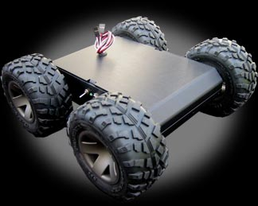
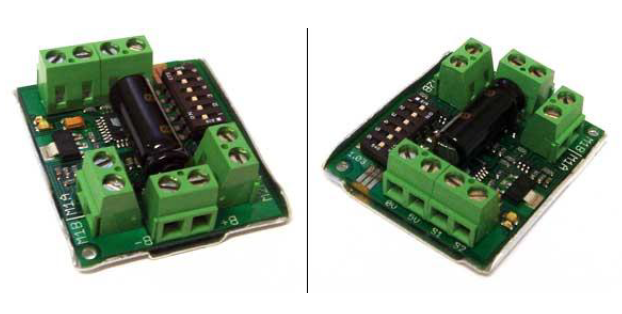

# Autonomous MMP-5 Robot Project

This project was the final project for the course XE475: Mechatronics. A paper was written for it, which is in the `docs` folder found [here](/projects/autonomous_mmp5_robot/docs/XE475_Final_Project_Paper.pdf), but this repository explains the project in the same amount of detail but in a different, more interactive way.

The objective of the project, as described in the XE475 Final Project paper, was the following:
1. Automate path following (line following) procedures using computer vision (pixyCam).
2. Implement decision making through use of a state machine.
3. Design and control a mechanism to engage targets.
4. Incorporate closed-loop control into mechatronic applications.
5. Prepare technical reports that include analysis of empirical data and evaluation of design options.

## MMP-5 Robot
The first thing we did for the project was pick an AUGV system to use on the course. While others in the course picked the Traxxas system, we decided to work with the Mechanical Mobile Platform v5 (MMP-5). The MMP-5 is a 4-wheel drive robot with Geolander tires. It's max speed is about 3.5 feet/second and max payload is 4 lbs. There is also a separate drive motor for both the right and left wheels, so it can perform neutral steering on the course, a great benefit when identifying and engaging targets at low speeds. More information about the robot specs on [their website](http://www.robotcombat.com/products/ML-MMP5.html).

   
   
 Figure 1. <i>The MMP-5 Robot</i>

I liked the MMP-5 robot better than the Traxxas because of it's ability to neutrally steer in place. The Traxxas's turn radius looked very difficult to manuever through a small course in the classroom. Though the Traxxas system was familiar to us because we used the robot for all other projects in the course, the MMP-5's ability to turn in place proved to be a superior capability for the course.

The first step was to figure out how to communicate with the MMP-5 from an Arduino Mega 2560. Looking through the provided documentation, we found that the MMP-5 has four different modes for communication:
1. Analog Input - This mode can be used to control the MMP-5 with something such as a potentiometer from 0-5V, or a PWM signal from an MCU such as an Arduino Uno from 0-5V. However, this mode is useful since we will be connecting the MMP-5 to an Arduino Mega 2560, similar to how we controlled the Traxxas system.
2. R/C Input - This mode can be used to control the MMP-5 with a regular R/C transmitter and receiver combo. However, for our use case, we won't need to use an R/C transmitter and receiver since everything will be controlled by the Arduino Mega 2560.
3. Simplified Serial - This mode can be used to control the MMP-5 with RS-232 serial communication at the TTL level (CMOS does not seem to be supported), and the baud rate can be set using the DIP switches on the motor driver board.

   
   
 Figure 2. <i>The MMP-5 Dual Channel Motor Driver</i>

With these options, the *Analog Input* seemed to be the best fit. Although the serial would have been a nice option with the Arduino Mega 2560, it seemed easier to use the PWM input since we were already familiar with it from previous projects, and it brings no downsides in terms of functionality and closed-loop control.

## Pixy2 Camera

The next part of the project consisted of figuring out how to use the Pixy2 cameras for both line following and detecting targets. The Pixy2 camera is a small, low-cost vision sensor that was used previously in the course for object detection purposes. While some groups decided to use one camera, and use a servo to move the camera to either point down for line following, then when needing to engage at a target, move the camera up to engage and "look" for the target.

Instead, we decided to use two Pixy2 cameras, and use a separate 5V switching regulator to convert the 9V from the battery to a stable 5V to power the Arduino Mega 2560, two Pixy2 cameras, and the servo for "engaging" with targets. The Pixy2 cameras were mounted on the front of the robot, one pointing down for line following, and the other on a "tower" mount for friendly/enemy target detection. The Pixy2 Cameras communicated with the Arduino Mega 2560 using the SPI protocol and used the Pixy2 Camera Arduino Library for easy interfacing.

## Continuous Servo

Part of the project deals with interacting with "targets", which are simple cardboard cutouts to make them easy (supposedly) to detect using the Pixy2 cameras. Below were the two types of targets (not including the "boss" target).

   
   
 Figure 3. <i>Friendly and Enemy colors</i>

For the friendly targets, the MMP-5 is supposed to locate the target, drive up to it, and play a tone from a buzzer located on the board to simulate communication. For the project, we played a short tone to communicate with the target, and then the robot would drive back to the point where it left, using the line following Pixy2 camera to find the line again.

On the other hand, for enemy targets, the MMP-5 is supposed to locate the target, and shoot it with some object (non-flammable, sadly). We decided to use rubber bands and a servo, since it made the design simpler to implement than using Nerf bullets, rubber balls, or another form of projectile. We had to test at a variety of distances to make sure the rubber band would be able to reach the target. The servo was controlled using a PWM signal from the Arduino Mega 2560, which, since it was a continuous servo (not a standard servo), allowed us to conduct full rotations of the servo, and thus load multiple rubber bands onto the servo by simply rotating them and "charging" the servo before moving the robot. We did encounter a problem with loading the servo with more than three rubber bands, however. The servo in a stationary or "0" speed position would not be able to hold back the rubber bands, and the servo would slightly move forward (releasing tension) and inadverently shoot rubber bands at random. To fix this, we added both a screw to the servo mount to have a better grip on the rubber band, but also would move the servo "back" every so often in order to keep the rubber bands from shooting. Though not the most elegant solution, it worked well enough for the project.

## Project Diagram

A diagram detailing key parts of the system are outlined below:

   
   
 Figure 4. <i>The Platform built on top of the MMP-5</i>

This diagram only outlines the main pieces of the project, and does not show items should as the buzzer or the start button on the small breadboard. However, it does show the two Pixy2 Cameras, the Arduino Mega 2560, the two MMP-5 motor drivers, the servo, and the 5V switching regulator.