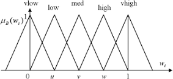

# Code for the autonomous MMP5 robot

This folder details the code for the project, and consists of the following files:

```bash
├─── Robot_Contoller.ino
├─── PID.h
├─── FuzzyControl.h
```

## Robot_Controller.ino

This is the main `.ino` for the Arduino project. The Arduino IDE was used for the class because of it's ease of use and simplicity for all members of the class to get into mechatronics. Though alternatives such as PlatformIO, or Atmel Studio could have been used, the Arduino IDE was the most accessible and best for prototyping on a tight deadline.

### Setup

Just like any Arduino project, the `setup()` and `loop()` functions are used to initialize the Arduino and run the main code. The `setup()` function is as followed:

```ino
Serial.begin(115200); // Init Serial
attachInterrupt(digitalPinToInterrupt(BUTTON_PIN), onPress, RISING); // attach interrupt to start program with button press
pixy_cannon.init(PIXY_CANNON_ADDR); // Initialize cannon Pixy cam

left_motors.attach(MOTOR2_PIN,500,2000); // Init motor pins
right_motors.attach(MOTOR1_PIN,500,2000); // Init motor pins
cannon.attach(CANNON_PIN); // Init cannon servo
cannon.write(1515); // set the cannon to zero

left_motors.write(STOP); // Stop motors 
right_motors.write(STOP); // Stop motors

pixy_line.init(PIXY_LINE_ADDR); // Initialize line following Pixy cam
pixy_line.setLamp(1, 1); // Turn on the lamp for the line following Pixy for better low-light vision
pixy_line.changeProg("line"); // Make sure pixy is set to line following

pinMode(BUZZER_PIN, OUTPUT); // set buzzer pin as an output

Serial.println("time,m_x,steering"); // Set the header up for the necessary text files in the data logger


/* ------- Setup for Fuzzy controller ---------- */

Steer.setMidPoints(30, 77, 155, 231, 295); // L, LM, M, RM, R
Steer.setMidPointsV(-25, -10, 0, 10, 25); //  VN, N, Z, P, VP (-100, -25, 0, 25, 100)
Steer.setSingletons(1600, 1550, 1450, 1350, 1300); // FF, FS, Z, BS, BF

Throttle.setMidPoints(33, 46, 60, 70, 80); // 22 in, 1 ft, 6 in, 4 in, 2 in
Throttle.setMidPointsV(-25, -10, 0, 10, 25); // VN, N, Z, P, VP (-25, -10, 0, 10, 25)
Throttle.setSingletons(100, 50, 0, -50, -100); // FF, FS, Z, BS, BF
```

The setup consists of beginning the serial comms at a `115200` baud rate, attaching an interrupt to the start button, and setting up some Pixy2 camera settings (like the lamp and switching to line following). For the Fuzzy Controller, `Steer` and `Throttle` are defined above the setup function, and are classes that are defined in the `FuzzyControl.h` file. Here are the function definitions for the `Steer `and `Throttle` classes:

```ino
void filterPixy(int newData)
void updateMembership()
int getCrispOutput()
void setSingletons(int FF, int FS, int Z, int BS, int BF)
void setMidPoints(float first, float seconD, float third, float fourth, float fifth)
void setMidPointsV(float first, float seconD, float third, float fourth, float fifth)
```

The function `setSingletons()` is used to set the singleton values for the Fuzzy Controller, which are used in calculating the output function. The function `setMidPoints()` is used to set the midpoints for the Fuzzy Controller, which are used in calculating the output function. The function `setMidPointsV()`, on the other hand, is used to calculate the velocity midpoints, since we need to track both position and velocity of the object in the Pixy2 Camera. The function `filterPixy()` is used to filter the data from the Pixy2 Camera, since the true "middle" of the object found (in this case, the targets), is not always the exact center. Here, the `filterPixy()` function uses an exponential moving average to filter the data. The `updateMembership()` function uses a private functions named `tmf`, `tmfl`, and `tmfr` to calculate the membership values of a triangular function, as shown below, in order to properly associate values with the singleton values.

<p align="center">
   
   <p align="center"> Figure 1. <i>Example of Triangular Function used to calculate membership values</i></p>
</p>

### Loop

The `loop()` function is as followed (simplified):

```ino
    if (isRunning) {
        if (no_line_found) {
            // stop motors
        }

        if (line_found) {
            // calculate error using PID control
            // set motor speeds
        }

        if (intersection_found) {
            // print to console
        }

        if (barcode_found) {
            switch (barcode) {
                case STOP:
                    // stop motors
                    break;
                case RIGHT:
                    // turn right
                    break;
                case LEFT:
                    // turn left
                    break;
                case OBJECTIVE:
                    // stop motors
                    
                    /* this stays in a while loop until a target
                     * is found and "dealt" with (both friendly and enemy) 
                     */
                    search_for_objective();  

                    // once the objective is found, turn the right direction back 
                    // to the line to follow the line in the correct direction.

                    break;
                case BOSS:
                    // stop motors
                    // find the boss and engage
            }
        }
    }
```

This loop shows the fundamentals for both line following and barcode scanning, but outlines the basics for how the robot operates throughout the course. There are most definitely improvements that can be made to the structure of the code as well as overall documentation, so this GitHub repository is a work in progress and will continue to serve as a place to house my projects and practice documentation. More information can be found in the comments within the code, or the written report in the `docs` folder.