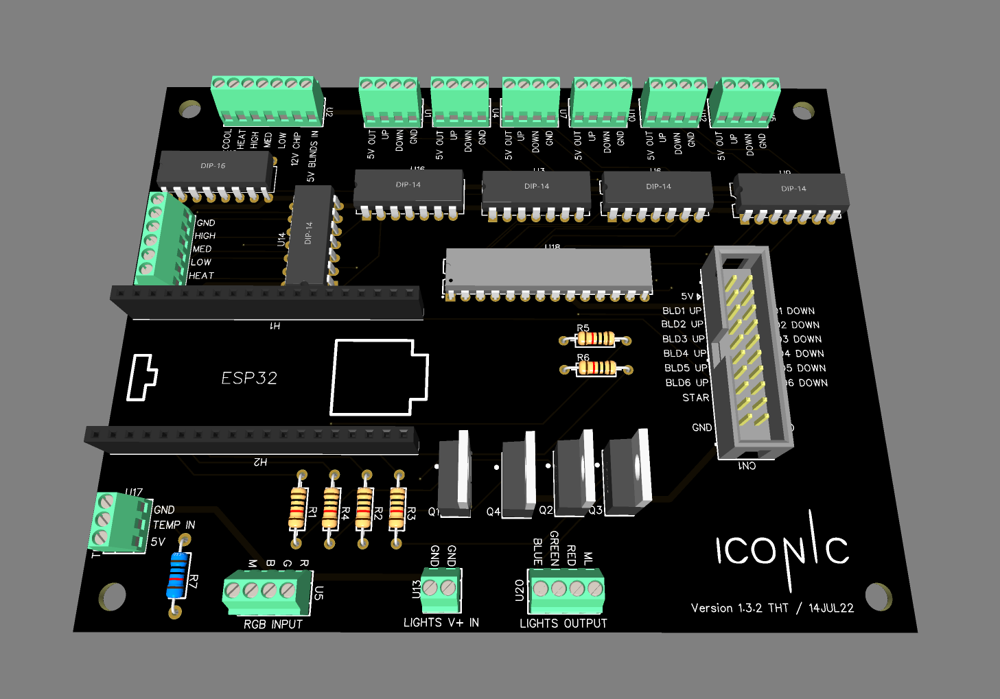
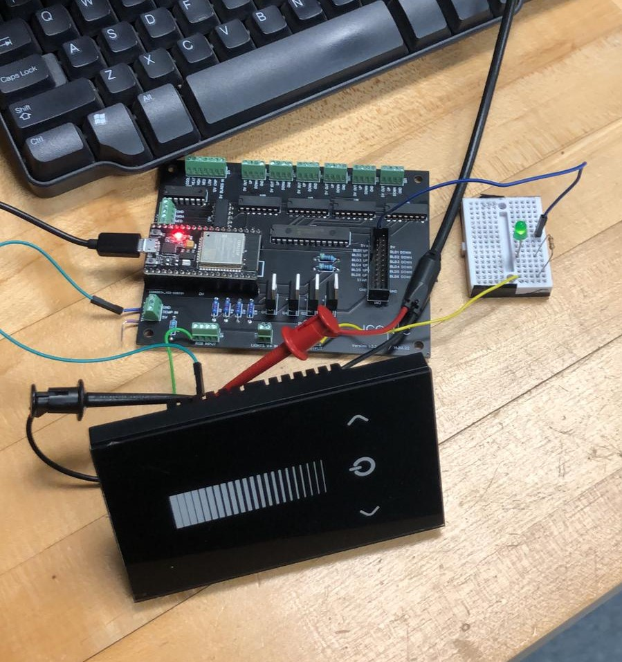
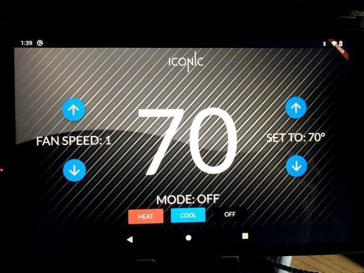
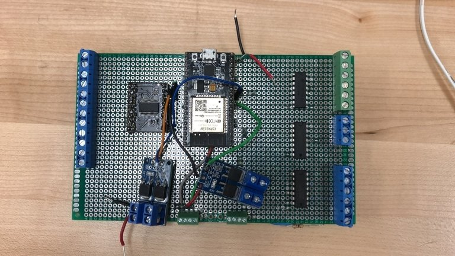
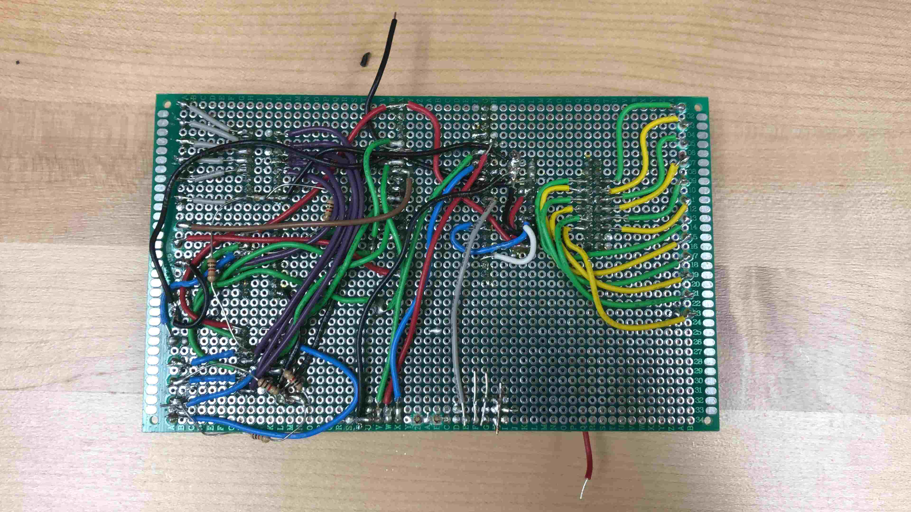
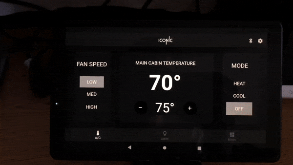
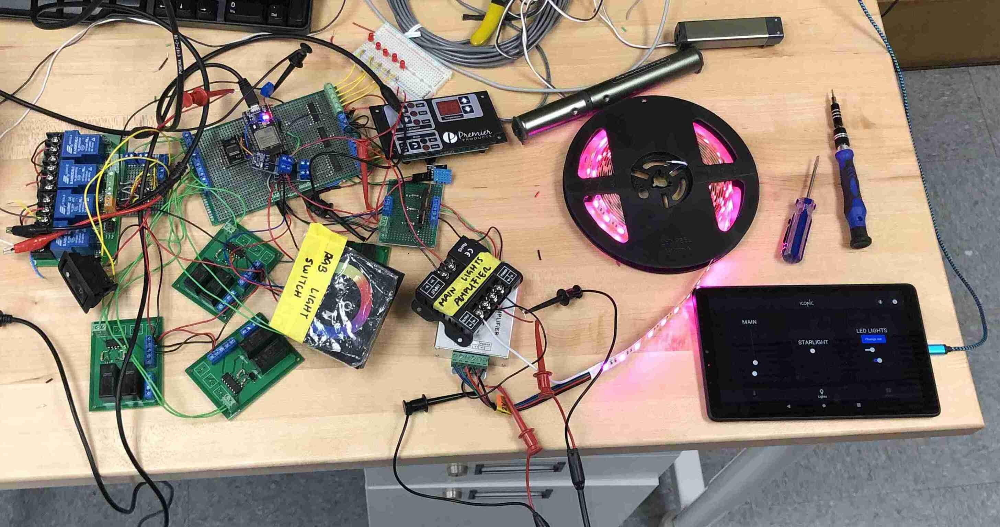
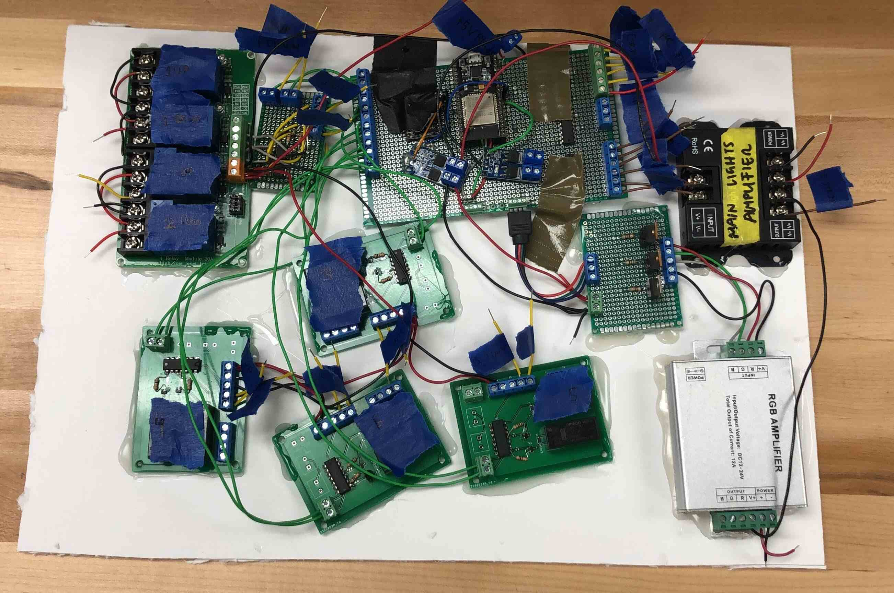
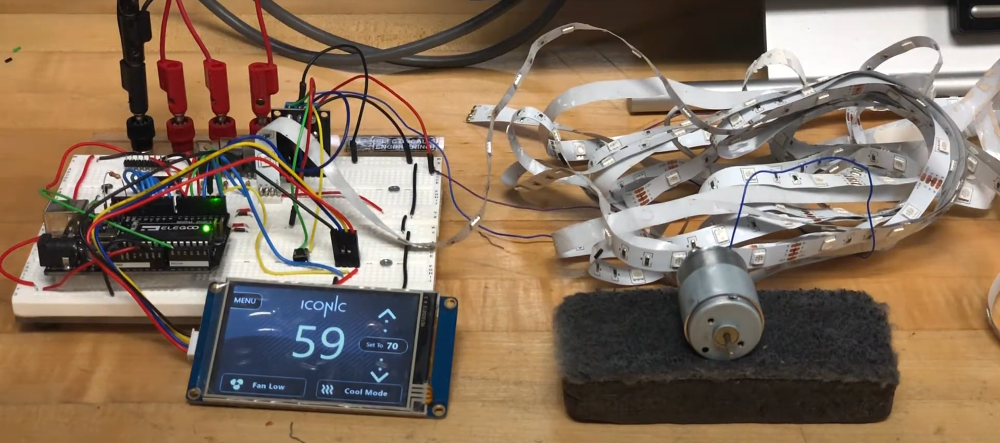
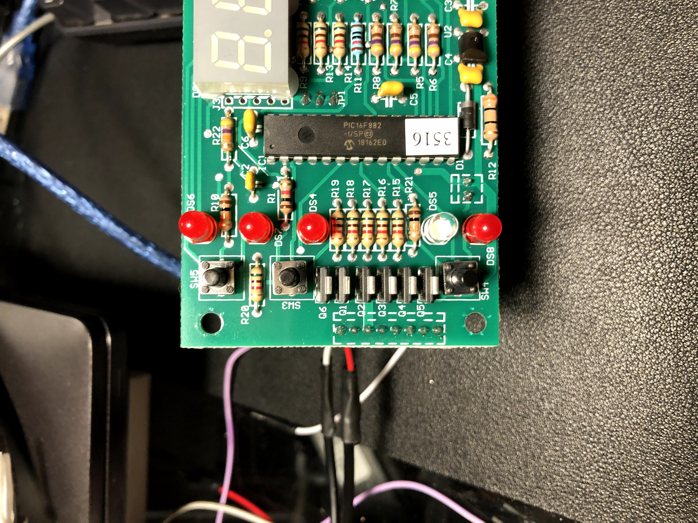

# Sprinter Van Control System Project

In January of 2021, I was home and I was curiously looking at sprinter vans in the Dallas area, just to see what the average price would be after seeing very modern ones on YouTube costing upwards of $100k. Most sprinter vans I saw had old control systems, particularly a company located in Dallas called Iconic Sprinter Vans, and I believed that I could design a control system that was more modern and user friendly. So, I decided to embark on the journey of designing a "mock-up" for a sprinter van. I had a genuine interest in seeing how close I could get to making something without knowing anything about the van. This README details the progress so far, as I've invested a good amount of time and money on the project and as of December 2022, I have a decently working prototype that I'm content with as I move on to other projects (and focus on finishing my senior year at WP).

## Project Overview
This project overview details the different versions I've gone through, including the hardware, software, and other problems I've encountered and how I've handled them accordingly.

## Table of Contents
  - [Version 0.3](#version-03)
  - [Version 0.2](#version-02)
  - [Version 0.1](#version-01)

## **NOTE: All logos for Iconic © Sprinter Vans are owned by Iconic © Sprinter Vans and are not owned by me. I am using them for educational purposes only.**

## *Version 0.3*

This version started after I wanted to move from the original van design to a more robust and manufacturable design. I designed a PCB that would house the same board I made for version 2, with some exceptions: 
1. Instead of individual blind modules, I am using a 12-relay board I bought on Amazon. To connect to it, I am using a 20-pin molex connector to bridge between my custom board and the relay board.
2. The main board previously should be converted to a single PCB that can be manufactured.

Here is a 3D view of version 1.3.2 of the board. A mistake was made and it should be 0.3.2:

   

Here are links to the [schematic](docs/pdfs/Schematic_ICONIC_V3_2.pdf) and [PCB layout](docs/pdfs/PCB_PCB_ICONIC_V3_2.pdf) in pdf format.

This board performed surprisingly well in the few tests that were done. I tested the functionality of using the "main lights" on the board:

   

I simply checked to see how the LED responded to changes in the input (coming straight from the capacitive touch panel). I had to crack open the capacitive touch panel to see if I could get a PWM signal out of it since the signal coming from the open connections was 12V (and I needed 5V signal levels). Sure, could I have just used a voltage divider? Or a level-shifter? Perhaps, but soldering a wire to the base of the power transistor inside was much easier, and worked well. I don't have any pictures of the PWM signal coming out (There was little to no overshoot on the signal and the duty cycle changed rather quickly to responding input). There needed to be two inputs to the ESP32. One was a callback from a serial BT connection, and the other was 

## *Version 0.2*
Our direction and motivation changed from the version 0.1 prototype. I changed the Nextion Display to instead use an Android Head Unit as the main controller. Initially, my goals were to:
1. Get an app up and running and communicate key presses and other functions over a popular wireless protocol.
2. Have a control board that can receive these commands over the wireless protocol and change the outputs accordingly (lights, blinds, etc.)

For this, I decided to go with the ESP32, since I had used it before on some personal projects and BLE was a common protocol on these Android Head Units. It was readily available and came as a nice development board when bought on Amazon (specifically, the ESP32-WROOM-32D dev boards).

I started learning how to make Android/iOS apps using Flutter, Google's method of fixing the problem of having two different codebases when making iOS and Android apps. Instead, with Flutter, you could develop on a single codebase and it can be exported to multiple platforms, including iOS and Android. After a couple quick tutorials on getting this working, here's the first picture of the "A/C" screen I worked on:

   

Simultaneously, I was working on a board that contained female headers for an ESP32 dev board and was connected to A/C outputs (via a darlington transistor array chip), light outputs, and a GPIO expander for the 6 blinds. Here is a snapshot of the first set of boards working with the app and a strip of LED lights:

   

The boards had tons of mistakes I made (flipped connections, missing 5V on reset pins for GPIO expander, missing external connectors). But, overall, it could have worked for a "demo" run after some modifications (you can see the botched wires on the PCB above).

***Shortly after,*** I then realized that it wouldn't be too easy to completely implement the system from scratch on a van, so what if it would be cheaper for any sprinter van company to just retrofit and coexist whatever system they already have with the ESP32 control board I built? Due to time and money already spent on the project, I had to make some interesting decisions with the available parts I had. Instead of potentially slapping on another MCU to handle multiple inputs, I instead added some OR gate chips from TI that were in the lab, which would allow either the ESP32 output signals or the output signals from the buttons/switches presumably already in the van to turn on/off whatever it is controlling, to the board. That required transitioning the existing switches/buttons in the van to run off of the *same voltage as the ESP32* and lots of changes to the code. Since I was scared to order another PCB again with too many mistakes, I wanted to first verify this thing would work and I decided to just buy a double-sided perfboard and wire everything myself:

Top View

   

Bottom View

   

Yes, I *do* see the mess of wires under the perfboard...not my best work. But it was good enough to get things up and running at least for the time being.

While this board was being built, I was also redesigning the entire app (and realizing the Android Head Unit I bought ran *only* on Bluetooth Classic, and had no BLE, so I had to switch the communication between the ESP32 and the tablet to BT Classic instead of BLE). Even though I conducted most of my testing using the tablet, I decided to go with BT Classic since it would work with most Android Tablets that were on the market at the time of writing this. Yes, BT Classic is chunky, but I wasn't concerned about that here since the ESP32 could handle the power as it was being connected to the Sprinter Van's power. Here's a short GIF of the second version of the app:

   

Once I had the main board soldered and wired together, I started testing the whole unit by adding the blinds modules (used relays for now to handle the motors since I had no idea what motors would be used for blinds in an actual van), the capacitive RGB and other light controllers (also transferred to ESP32 voltages), and the A/C controller board that originally came with the A/C unit. Here's a gif of the testing for the A/C unit:

   

The breadboard containing the five red LEDs are there to *simulate the real A/C unit*, which has *LOW*, *MEDIUM*, *HIGH*,    *HEAT*, and *COOL*. The top three LEDs are for the fan setting, and the bottom two are for *HEAT* and *COOL*. I wanted to have both the A/C input buttons as well as the inputs from the ESP32. So, for now, the easiest option was to use an SN74HC32N chip from TI (OR gates) to turn on the A/C output if either the button inputs or the ESP32 outputs are pulled *high*.

Here's the final layout, with all of the individual blind module controllers wired up (not the cleanest setup possible):

   

I was able to put all of this onto a piece of formboard to count as a final "layout".

   

Version 0.3 takes on some new challenges, where I wanted to condense the board and stopped using individual relay boards that I made for myself.

## *Version 0.1*
The main goal for this first iteration was just getting something on the table. I chose to go with a Nextion Display connected to an Arduino Uno. 

   

The Arduino Uno was connected to 5V, where three pins connected to three TIP120 transistors to simulate handling the LED strip, and the motor was handled using a small relay just to show that the "on/off" functionality worked.

I have a friend from home who works at an auto repair shop, and I asked if he had any extra A/C type units lying around that I could use for this project just to "prove a concept". He had an old 12V A/C unit that came with both a control board and the real A/C unit that I assume could connect to pumps of some sort? Regardless, the board has 12V relays that I could to "simulate" whether a setting on the A/C is turned on or off, so it will work fine for now.

My first idea was to look at mimicing the outputs driven by the control board. At this time, I essentially just wanted to replace this control board with my ESP32, and have the ESP32 control the lights and blinds in a "van".

   

From the board, I knew that the Q1-5 were transistors, probably switching the 5V logic voltage level on the board to 12V for the relay board. So, I just thought, I could easily replicate this with a transistor array or a darlington transistor array and step up the voltage. But, I first had to figure out what pins outputted which voltages, here's what I found:

- YELLOW: 12V
- PINK: NC
- BLACK: GND
- BLUE: COOL
- GREEN: HEAT
- WHITE: LOW
- RED: MEDIUM
- BROWN: HIGH

With that, I now knew what to look for when testing the setup with the A/C unit.

