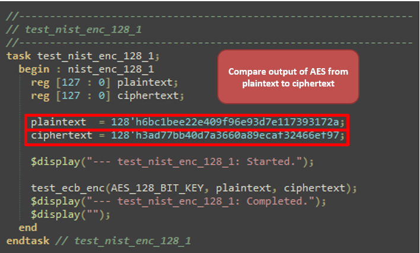
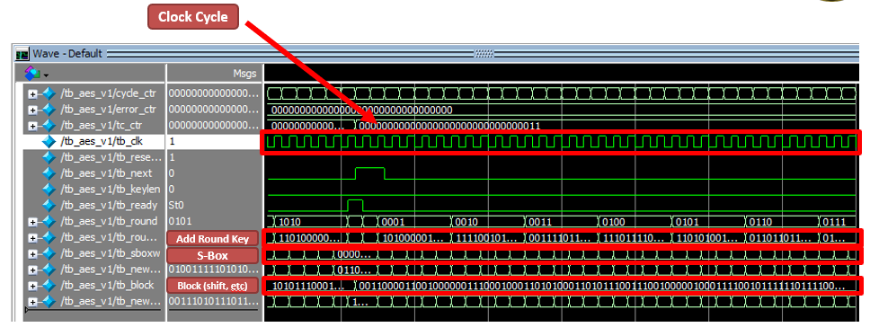

# AES v1 - Encryption

Although seems like a big jump going from hexademical and seven-segment displays to AES, I wanted to get a feel for how to implement a larger project on the FPGA and get closer to due dates for the board being produced.

This is the first iteration of using the AES encryption method to test on the FPGA. This is a work in progress, and will be updated as I learn more about the embedded decryption as well on the platform.

Due to time constraints, the code was replicated from [the following repository](https://github.com/secworks/aes).

The repository has both encryption and decryption methods available, but for time, I'm focusing on the *encryption* method in this folder. What I had to figure out was mainly integrating this on-to the board and seeing how to implement this with switches or LEDs in order to get feedback. Well...unfortunately I didn't get that part working, and instead used the testbench that was included in the repo to make sure I could run it in Quartus. I figured that since the output of the testbench are `reg` values, I can easily integrate that later once I get UART working.

The top file is the `DE1_SOC_golden_top.v`, and it came directly with Quartus as an example top folder. This, integrated with the rest of the AES folders inside `verilog files`, I was able to successfully upload to the board (though no indication of whether things work or not...) and run the testbench successfully in quartus. The following below are from the PowerPoint presentation I created to demonstrate my "end of the year progress" to the professors in charge of the independent study.

   
   
 Figure 1. <i>AES Testbench code</i>

   
   
 Figure 2. <i>AES Testbench simulation</i>

You can find more on the project in the [PPT presentation linked here](/projects/verilog_encryption_project/docs/EE389_Final_Presentation.pptx).